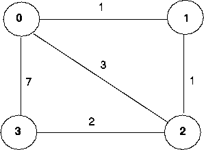
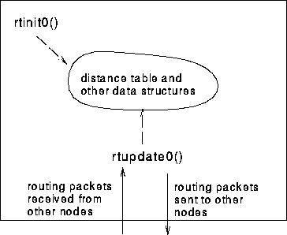

Programming Assignment 6: Implementing an Algorithm
===================================================

### Overview

In this lab, you will be writing a "distributed" set of procedures
that implement a distributed asynchronous distance vector routing for
the network shown in Figure Lab.4-1.



**Figure Lab.4-1:** Network topology and link costs for DV routing lab

### The Basic Assignment

**The routines you will write** For the basic part of the assignment,
you are to write the following routines which will "execute"
asynchronously within the emulated environment that we have written for
this assignment.

For node 0, you will write the routines:

-   `rtinit0()` This routine will be called once at the beginning of the
    emulation. `rtinit0()` has no arguments. It should initialize the
    distance table in node 0 to reflect the direct costs of 1, 3, and 7
    to nodes 1, 2, and 3, respectively. In Figure 1, all links are
    bi-directional and the costs in both directions are identical. After
    initializing the distance table, and any other data structures
    needed by your node 0 routines, it should then send its
    directly-connected neighbors (in this case, 1, 2 and 3) the cost of
    its minimum cost paths to all other network nodes. This minimum cost
    information is sent to neighboring nodes in a *routing packet* by
    calling the routine `tolayer2()`, as described below. The format of
    the routing packet is also described below.
-   `rtupdate0(struct rtpkt *rcvdpkt)`. This routine will be called when
    node 0 receives a routing packet that was sent to it by one if its
    directly connected neighbors. The parameter `*rcvdpkt` is a pointer
    to the packet that was received.

`rtupdate0()` is the "heart" of the distance vector algorithm. The
values it receives in a routing packet from some other node *i* contain
*i*'s current shortest path costs to all other network nodes.
`rtupdate0()` uses these received values to update its own distance
table (as specified by the distance vector algorithm). If its own
minimum cost to another node changes as a result of the update, node 0
informs its directly connected neighbors of this change in minimum cost
by sending them a routing packet. Recall that in the distance vector
algorithm, only directly connected nodes will exchange routing packets.
Thus nodes 1 and 2 will communicate with each other, but nodes 1 and 3
will not communicate with each other.

As we saw in class, the distance table inside each node is the principal
data structure used by the distance vector algorithm. You will find it
convenient to declare the distance table as a 4-by-4 array of `int`s,
where entry `[i,j] `in the distance table in node 0 is node 0's
currently computed cost to node i via direct neighbor j. If 0 is not
directly connected to *j* you can ignore this entry. We will use the
convention that the integer value 999 is infinity.

Figure Lab.4-2 provides a conceptual view of the relationship of the
procedures inside node 0.

Similar routines are defined for nodes 1, 2 and 3. Thus, you will write
8 procedures in all:
`rtinit0(), rtinit1(), rtinit2(), rtinit3(),rtupdate0(),  rtupdate1(), rtupdate2(), rtupdate3()`



**Figure Lab.4-2:** Relationship between procedures inside node 0

### Software Interfaces

The procedures described above are the ones that you will write. We have
written the following routines that can be called by your routines:

`tolayer2(struct rtpkt pkt2send)`

where `rtpkt` is the following structure, which is already declared
for you. The procedure `tolayer2()` is defined in the file
[prog3.c](http://gaia.cs.umass.edu/kurose/network/prog3.c)

```
extern struct rtpkt {
    int sourceid;  /* id of node sending this pkt, 0, 1, 2, or 3 */
    int destid;    /* id of router to which pkt being sent
                    (must be an immediate neighbor) */
    int mincost[4];    /* min cost to node 0 ... 3 */
    };
```

Note that `tolayer2()` is passed a structure, not a pointer to a
structure.

`printdt0()` will pretty print the distance table for node 0. It is
passed a pointer to a structure of type `distance_table.` `printdt0()`
and the structure declaration for the node 0 distance table are declared
in the file `node0.c.` Similar pretty-print routines are defined for
you in the files `node1.c, node2.c node3.c.`

### The Simulated Network Environment

Your procedures `rtinit0(), rtinit1(), rtinit2(), rtinit3()` and
`rtupdate0(), rtupdate1(), rtupdate2(), rtupdate3()` send routing
packets (whose format is described above) into the medium. The medium
will deliver packets in-order, and without loss to the specified
destination. Only directly-connected nodes can communicate. The delay
between is sender and receiver is variable (and unknown).

When you compile your procedures and my procedures together and run the
resulting program, you will be asked to specify only one value regarding
the simulated network environment:

-   **Tracing.** Setting a tracing value of 1 or 2 will print out useful
    information about what is going on inside the emulation (e.g.,
    what's happening to packets and timers). A tracing value of 0 will
    turn this off. A tracing value greater than 2 will display all sorts
    of odd messages that are for my own emulator-debugging purposes.

A tracing value of 2 may be helpful to you in debugging your code. You
should keep in mind that *real* implementors do not have underlying
networks that provide such nice information about what is going to
happen to their packets!

### The Basic Assignment

You are to write the procedures `rtinit0(), rtinit1(), rtinit2(),  rtinit3()` and
`rtupdate0(), rtupdate1(), rtupdate2(), rtupdate3()` which together will
implement a distributed, asynchronous computation of the distance tables
for the topology and costs shown in Figure 1.

You should put your procedures for nodes 0 through 3 in files called
node0.c, node1.c, node2.c and node3.c. You are **NOT** allowed to declare
any global variables that are visible outside of a given C file (e.g., any global
variables you define in `node0.c.` may only be accessed inside
`node0.c`). This is to force you to abide by the coding conventions that
you would have to adopt is you were really running the procedures in
four distinct nodes.

To compile your routines: `gcc prog3.c node0.c node1.c node2.c node3.c`

Prototype versions of these files are here:

[node0.c](http://gaia.cs.umass.edu/kurose/network/node0.c),
[node1.c](http://gaia.cs.umass.edu/kurose/network/node1.c),
[node2.c](http://gaia.cs.umass.edu/kurose/network/node2.c),
[node3.c](http://gaia.cs.umass.edu/kurose/network/node3.c).
[prog3.c](http://gaia.cs.umass.edu/kurose/network/prog3.c).

**This assignment can be completed on any machine supporting C. It makes
no use of UNIX features.**

As always, most instructors would expect you to hand in a code listing,
a design document, and sample output.

For your sample output, your procedures should print out a message
whenever your `rtinit0(), rtinit1(), rtinit2(), rtinit3()` or
`rtupdate0(),  rtupdate1(), rtupdate2(), rtupdate3()` procedures are
called, giving the time (available via my global variable `clocktime`).
For `rtupdate0(),  rtupdate1(), rtupdate2(), rtupdate3()` you should
print the identity of the sender of the routing packet that is being
passed to your routine, whether or not the distance table is updated,
the contents of the distance table (you can use my pretty-print
routines), and a description of any messages sent to neighboring nodes
as a result of any distance table updates.

The sample output should be an output listing with a TRACE value of 2.
Highlight the final distance table produced in each node. Your program
will run until there are no more routing packets in-transit in the
network, at which point our emulator will terminate.

### The Advanced Assignment

You are to write two procedures,
`rtlinkhandler0(int linkid, int  newcost)` and
`rtlinkhandler1(int linkid, int newcost)`, which will be called if (and
when) the cost of the link between 0 and 1 changes. These routines
should be defined in the files `node0.c` and `node1.c,` respectively.
The routines will be passed the name (id) of the neighboring node on the
other side of the link whose cost has changed, and the new cost of the
link. Note that when a link cost changes, these routines will have to
update the distance table and may (or may not) have to send updated
routing packets to neighboring nodes.

In order to complete the advanced part of the assignment, you will need
to change the value of the constant LINKCHANGES (line 3 in `prog3.c)` to 1.
FYI, the cost of the link will change from 1 to 20 at time 10000 and
then change back to 1 at time 20000. Your routines will be invoked at
these times.

We would again **STRONGLY** recommend that you first implement the
undergraduate assignment and then extend your code to implement the
graduate assignment. It will **not** be time wasted. (Believe me, I
learned this the hard way!)

### JAVA Version Of This Assignment

The documentation above describes the project in detail. Here we
provide a link to the code needed to do the assignment in JAVA. Make
sure you understand the material above.

The JAVA code you'll need can be found here:
<http://gaia.cs.umass.edu/cs453_fall_2010/hw_pa_labs/distance_vector_java_code>.

You'll the write the constructors of Entity0.java, Entity1.java,
Entity2.java, and Entity3.java which are analogous to rtinit0(),
rtinit1(), rtinit2() and rtinit3() in the C version. You will also need
to write the update() methods for Entity0.java, Entity1.java,
Entity2.java, andEntity3.java which are analogous to rtupdate0(),
rtupdate1(), riupdate2() and rtupdate3() in the C version.

Note that the Java code will allow you to hang yourself by sending
incorrect packets via the toLayer2()method of NetworkSimulator. So
please be extra careful there.

### Q&A

When we've taught this lab in our introductory networking course,
students have posed various questions. If you are interested in looking
at the questions we've received (and answers), check out:
[qa.md](qa.md). The original page is available at <http://gaia.cs.umass.edu/kurose/network/programming_assignment_QA.htm>.


